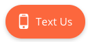

# Multi-Dealer VIN Routing Instructions

The Multi-Dealer VIN Routing feature works by reading the VIN from the data-vin
attribute of the CarCode widget:

`data-vin="1ABCD23DFGH4567890"`

The Vin routing feature is enabled via a setting in the CarCode Admin App 
that will be activated when the dealer accounts are provisioned in CarCode
(handled by the Edmunds team):


To integrate widgets with this capability on a dealer website, you must 
first integrate the default CarCode widget script into the header tag
of the website -- this should be consistent with your method of doing so 
today. This will enable the floating CarCode widget button.

Next, to include an embedded button within the vehicle card on an SRP or VDP,
there are two methods you can employ:

**Embedded SDK Button**

The easiest way to add a button with the data-vin attribute is through the
*Embedded SDK button* feature.

1. Create a div with the class `carcode-sdk-button`
2. Add the data-vin attribute
3. Add any additional vehicle information attributes that are available

example:

```
<div
  class="carcode-sdk-button"
  data-make="toyota"
  data-model="camry"
  data-vin="1FMCU0G9XJUC63611"
  data-year="2019"
  data-status="NEW"
>
</div>
```

This will automatically inject the button within the div.



The dealer can apply custom styling to the button by reaching out to your
widgets implementation team, who can manage settings in the CarCode tool
that affect display and styling.

**Standard SDK**

For granular control of the widget button, you may also add your own custom
anchor tag with the class `sms-button`. Be sure to continue to pass the
data-vin attribute with an associated value in order to ensure lead 
routing is made to the correct dealership.

example:

```
<a 
  class="sms-button"
  href="#"
  data-make="[MAKE]"
  data-model="[MODEL]"
  data-vin="[VIN_CODE]"
  data-year="[YEAR]"
  data-status="[NEW_OR_USED]"
>
  Call to Action
</a>
```

